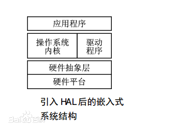
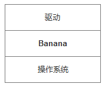

基于操作系统之上的系统接口封装
----
> 主要封装一些驱动常用的, 但各个操作系统之间存在差异的接口

先来看一下经典的**硬件抽象层(HAL)**

这里的驱动和操作系统内核紧密相关, 完成对硬件的操控

# 那么问题来了
驱动和内核形成了强依赖关系. 如果换一个内核, 比如从linux内核, 换成windows内核, 驱动就面临无法编译运行的尴尬境地

# 怎么办?
**解偶合**
> 将内核与驱动解偶, 让驱动不直接依赖于内核, 而依赖于一个中间层

这就是Banana库所做的事.

