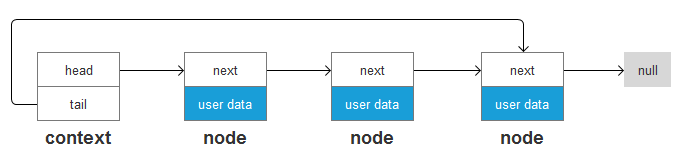
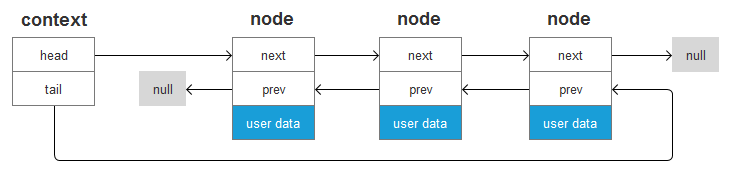
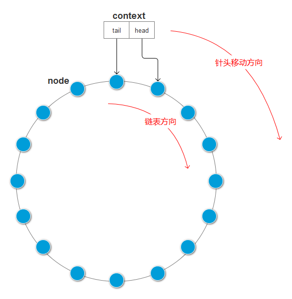

一. 常用数据结构的实现库
----

## 单向链表(CsList)


- 适用:
    - 表头增加, 删除操作.
    - 表尾只支持增加操作.
    - 表中间插入操作.

## 双向链表(CsDList)


- 适用:
    - 表头和表尾增加, 删除操作
    - 表中间插入操作.


## 单向环形缓冲区(CsRingBuf)


- 适用:
    - 队列头部增加, 删除操作
    - 队列尾部只支持增加操作
    - 不支持中间插入

## 哈希表(CsLinkedHashMap)

- 适用:
    - 对键值对存储, 查找等操作
    - 顺序遍历(采用双向链表将整张哈希表链起来, 实现顺序遍历)

## 写Buf工具(CsBufWriter)
- 适用:
    - 往一段buf以追加的方向,写入各种各样的数据类型.
    - 序列化

## 切Buf工具(CsBufSpliter, CsFastBufSpliter)
- 适用:
    - 将一整段buf进行切割
    - 反序列化

## 乒乓Buf(CsPingPangBuf)


二. 接口规范
----

- 使用大概分4步:
    1. **<font color=red>Cs</font>XXX<font color=red>Context</font> ctx** // 创建一个XXX类型的对象
    2. **<font color=red>Cs_</font>XXX<font color=red>Init</font>(&ctx)** // 初始化接口
    3. **<font color=red>Cs_</font>XXX<font color=red>Operations</font>(&ctx, params)** // 各项操作接口
    4. **<font color=red>Cs_</font>XXX<font color=red>Uninit</font>(&ctx)** // 反初始化接口

- 命名规则:
    1. 类型名首字母大写: Type
    2. 函数名: ModuleName_FunctionName()
    3. 变量名: value


伪代码示例:
```
typedef struct {
    int id;
    int age;
} MyListNode;

Cs_ListInit ctx;
csListInit(&ctx); // 初始化对象

MyListNode node1;
MyListNode node2;

Cs_ListPushFront(&ctx, node1); // 插入到链表头部
Cs_ListPushBack(&ctx, node2); // 插入到链表尾部

int count = Cs_ListGetSize(&ctx); // 获取链表节点个数
MyListNode head = Cs_ListPopFront(&ctx); // 弹出头节点
MyListNode tail = Cs_ListPopFront(&ctx); // 弹出头节点

Cs_ListUninit(&ctx); // 反初始化, 释放链表
```