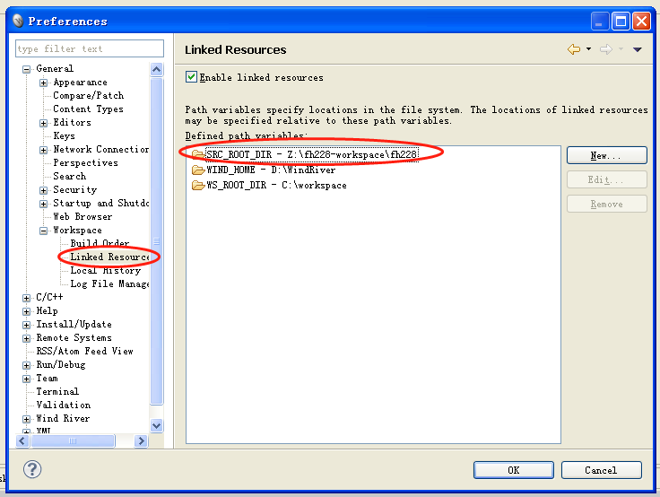
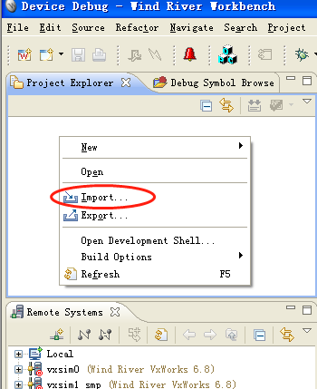
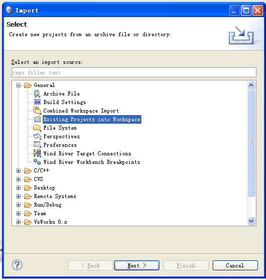
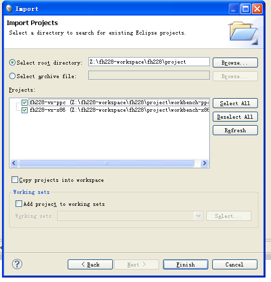

#一.项目描述
-数据高速交换板卡
-NT端可以向NT和NC端发送数据，数据分为周期消息和数据
-
# 二. 目录结构
- 3rdparty: 存放着第三方库文件
- include: 对外发布的头文件
- src: 存放着工程的源代码
- project: 存放着各种IDE的工程文件
- test: 测试代码

# 三. 如何使用workbench编译本驱动代码

- 打开Workbench, workspace的路径, 选择你自己的workspace路径就行, 没有要求
- 到菜单的**Window->Preference**下, 添加一个路径宏: `FH228_SRC_ROOT_DIR`, 指向本驱动的根文件夹

 

- 对着空白处右键, 选择`import`

 

- 选择`Existing projects into workspace`

 

- 选择本驱动的project文件夹, workbench会自动扫描出所有的工程文件, 如下图, 点击**Finish**即可.

 